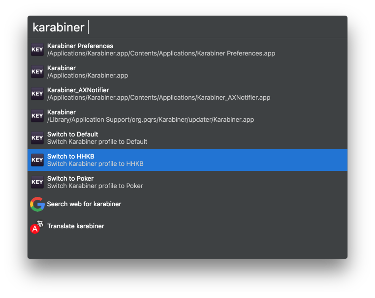

# Karabiner Profile Switcher for Cerebro

> Cerebro plugin to switch Karabiner profile

## Usage

In Cerebro, type `karabiner [PROFILE NAME]` to switch Karabiner profile. Use <kbd>↩</kbd> to switch to the seelcted profile.
